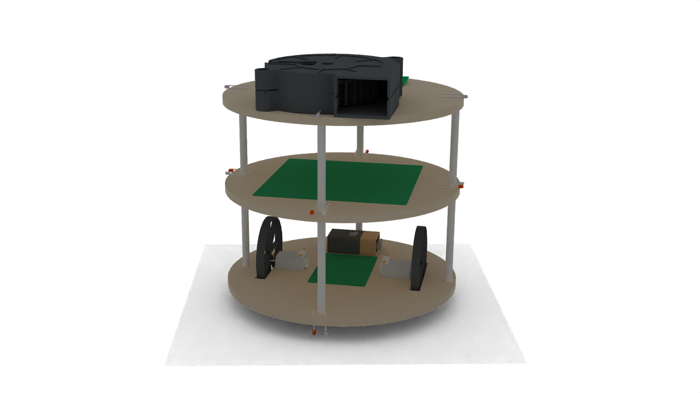
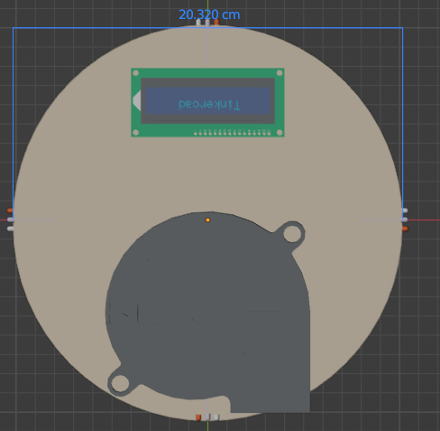
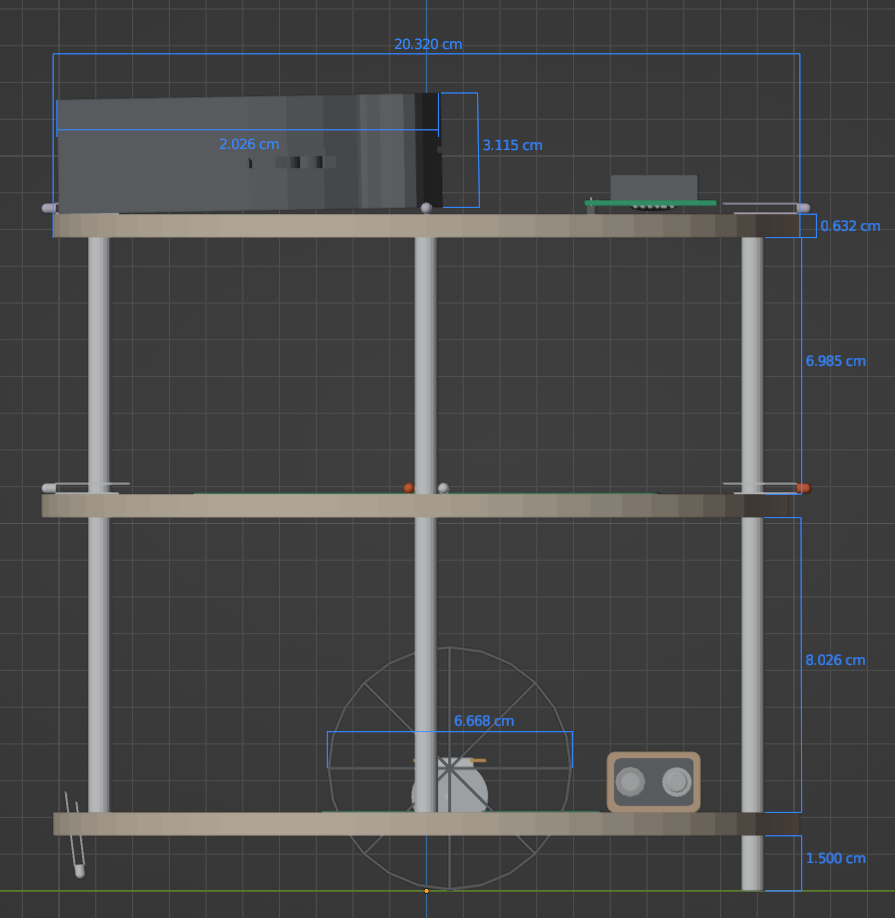
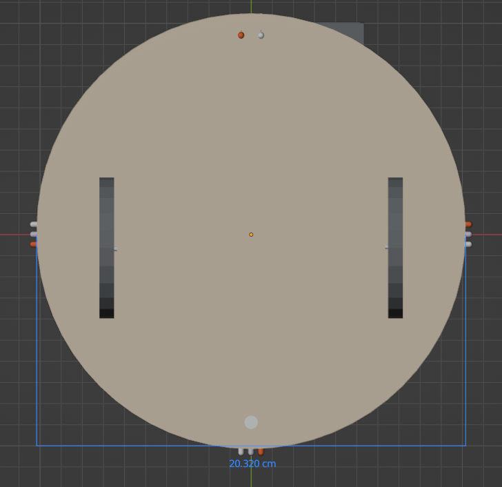

# FirefighterBot

    

## Project Overview

The Firefighter Bot is a fully autonomous robot designed to navigate a maze, locate a flame, and extinguish it using line and wall detection. Built entirely from scratch, this project involved designing the circuit, constructing the physical bot, and programming the algorithm for its operation. The robot uses sensors to detect walls and lines, navigating through a maze while searching for the flame. Upon detecting the flame, the bot activates its extinguishing mechanism.

## Features

- **Maze Navigation**: The bot is equipped with sensors to detect walls and follow lines to navigate through the maze.
- **Flame Detection**: The bot uses a sensor to locate the flame.
Extinguishing Mechanism: Upon detecting the flame, the bot activates its extinguishing mechanism to put out the fire.
- **Autonomous Operation**: The bot operates without human intervention, performing tasks from maze navigation to flame extinguishing.

## Hardware Components

- **Microcontroller**: A microcontroller (programmed with Great Cow Basic) serves as the central control unit for the bot, processing sensor inputs and controlling the robot's motors.
Sensors:
- **Line Sensors**: Used to follow a path or track.
- **Wall Sensors**: Help the bot detect obstacles and navigate around the maze.
- **Flame Sensor**: Used to detect the flame in the maze.
- **Motors**: Control the movement of the bot.
- **Extinguishing Mechanism**: Activated once the flame is detected.

## Software
The bot is programmed using Great Cow Basic, a powerful BASIC compiler for PIC microcontrollers. The algorithm was designed to ensure the bot can:

- Navigate through the maze by following lines and avoiding obstacles.
- Detect the flame and approach it.
- Trigger the extinguishing mechanism once the flame is within range.

## Design

  
  
  

